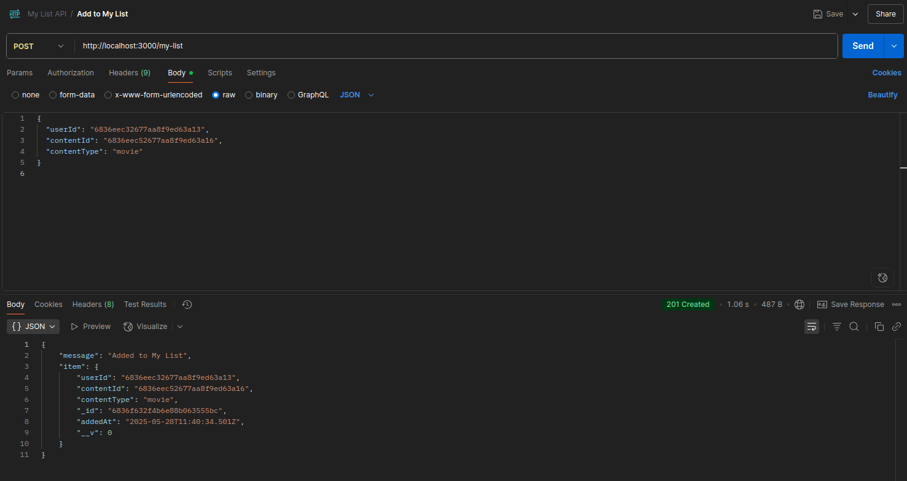
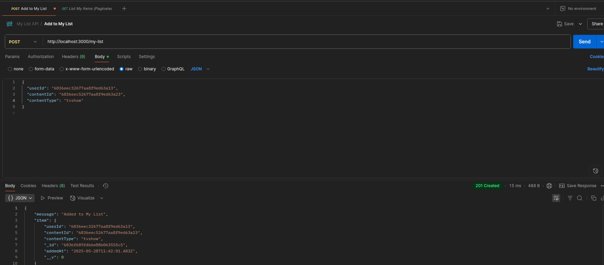
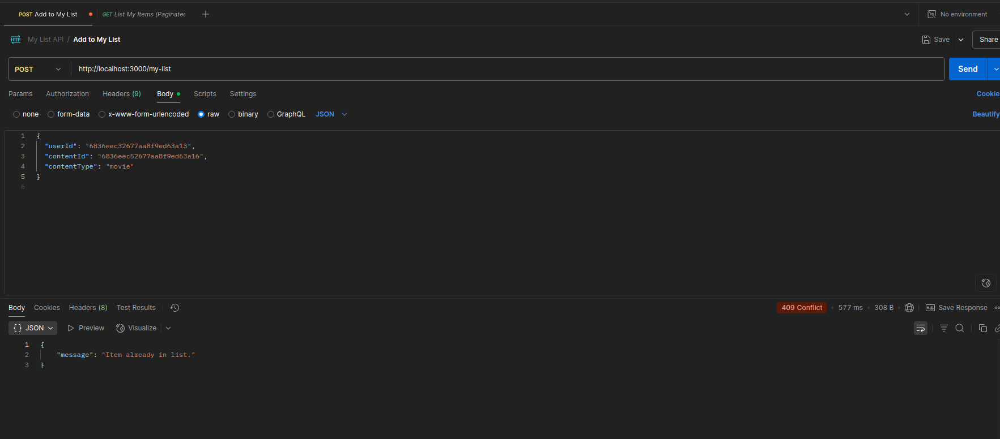
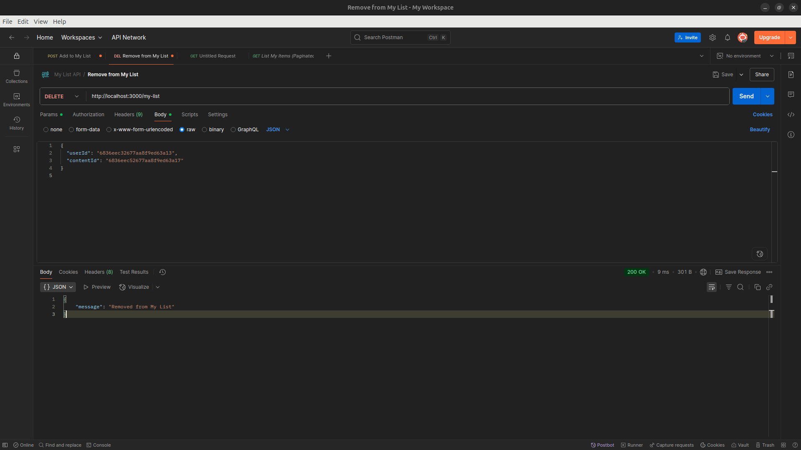
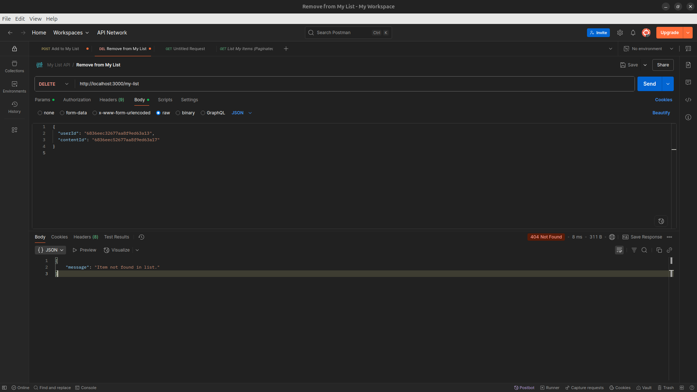
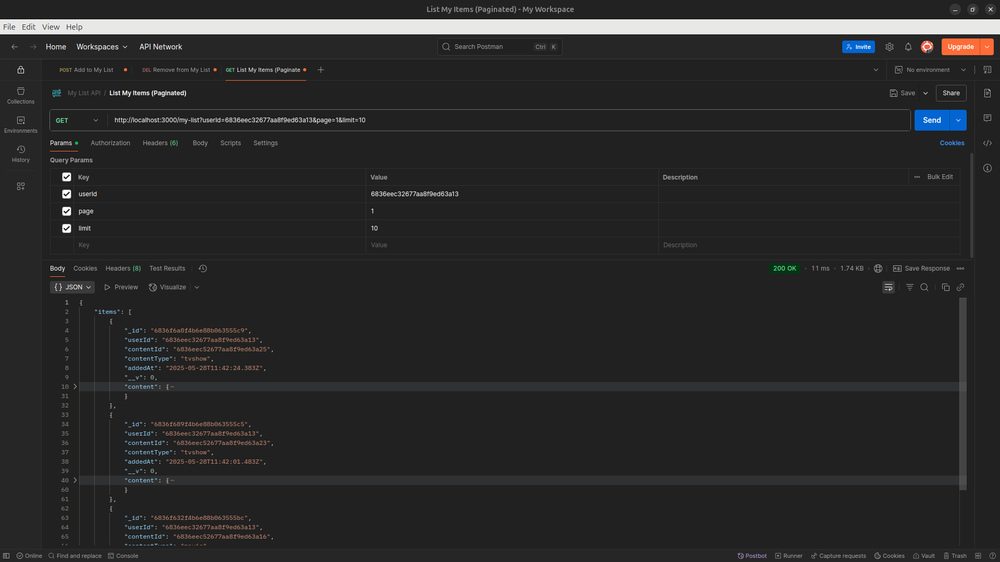
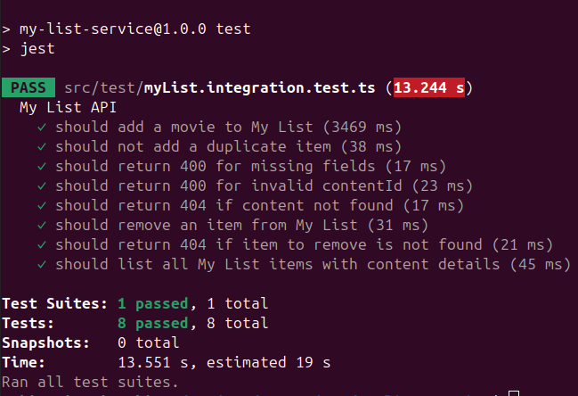

# 🎬 My List Service

A backend service for the **My List** feature of an OTT platform, allowing users to save, remove, and list their favorite movies and TV shows. Built with **TypeScript**, **Express.js**, and **MongoDB**.

---

## 🌟 Features

* **Add to My List**: Save movies or TV shows to a personalized list (duplicates prevented).
* **Remove from My List**: Remove any saved movie or TV show.
* **List My Items**: Retrieve a **paginated list** of saved content for a user.

---

## 🧰 Tech Stack

* **Backend**: Node.js, TypeScript, Express.js
* **Database**: MongoDB (via Mongoose)
* **Testing**: Jest, Supertest

---

## ⚙️ Getting Started

### 🔗 Clone the Repository

```bash
git clone https://github.com/ankittiwari2001/my-list-service.git
cd my-list-service
```

---

### ⚙️ Local Development Setup

#### 1. Install Dependencies

```bash
npm install
```

#### 2. Configure Environment

Create a `.env` file in the root:

```env
MONGO_URI=mongodb://localhost:27017/mylist
PORT=3000
```

> ✅ Make sure MongoDB is running locally before starting the server.
> You can start MongoDB using: `sudo service mongod start` (Linux) or via MongoDB Compass or Docker.

#### 3. (Optional) Seed Initial Data

To populate your database with sample content:

```bash
npm run seed
```

#### 4. Start the Development Server

```bash
npm start
```

Server will be available at: `http://localhost:3000`

---

### 🐳 Docker Setup (Alternative)

You can run the service and MongoDB using Docker:

```bash
sudo docker compose up --build
```

> This will:
>
> * Start the **My List Service** on `http://localhost:3000`
> * Start a **MongoDB** instance on `mongodb://localhost:27017`
> * Start **Mongo Express** (web UI for MongoDB) on `http://localhost:8081`

#### 🔍 Accessing Mongo Express

You can inspect the MongoDB database using Mongo Express:

* **URL**: [http://localhost:8081](http://localhost:8081)
* **Username**: `admin`
* **Password**: `admin`

> Use this to view collections, query documents, and verify data in real-time.


---

## 📮 API Endpoints

> 🧪 [Test and explore using Postman](https://planetary-spaceship-400818.postman.co/workspace/My-Workspace~9e1f99bd-1459-4606-845e-90fb9beac374/collection/23805380-912f0ac0-e490-48e4-8335-362e9c2dd5e0?action=share&creator=23805380)

---

<details>
<summary>➕ <strong>Add to My List</strong> — <code>POST /my-list</code></summary>

**Request Body:**

```json
{
  "userId": "<userId>",
  "contentId": "<contentId>",
  "contentType": "movie" // or "tvshow"
}
```

**Sample Responses:**





</details>

---

<details>
<summary>❌ <strong>Remove from My List</strong> — <code>DELETE /my-list</code></summary>

**Request Body:**

```json
{
  "userId": "<userId>",
  "contentId": "<contentId>"
}
```

**Sample Responses:**




</details>

---

<details>
<summary>📃 <strong>List My Items</strong> — <code>GET /my-list</code></summary>

**Query Parameters:**

* `userId`: Required
* `page`: Page number (default: 1)
* `limit`: Items per page (default: 10)

**Example:**

```
GET /my-list?userId=6655f5be23b0d1a0e3cfa567&page=1&limit=10
```

**Sample Response:**



</details>

---

## 🧪 Testing

Run integration tests:

```bash
npm test
```

> Uses in-memory MongoDB for isolated testing.



---

## 📐 Design Notes

* **Schema**: `MyListItem` with `userId`, `contentId`, and `contentType`.
* **Performance**:

  * Indexed `userId` and `contentId`
  * Lean queries for performance
  * Pagination via `skip` and `limit`
* **Idempotency**: Prevents duplicate content entries per user.

---

## ✅ Assumptions

* Authentication is assumed; `userId` is passed directly in the request.
* Movie/TV content should exist in the DB.
* No frontend or auth middleware included.

---
